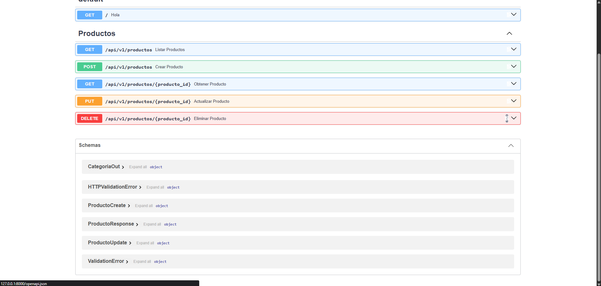
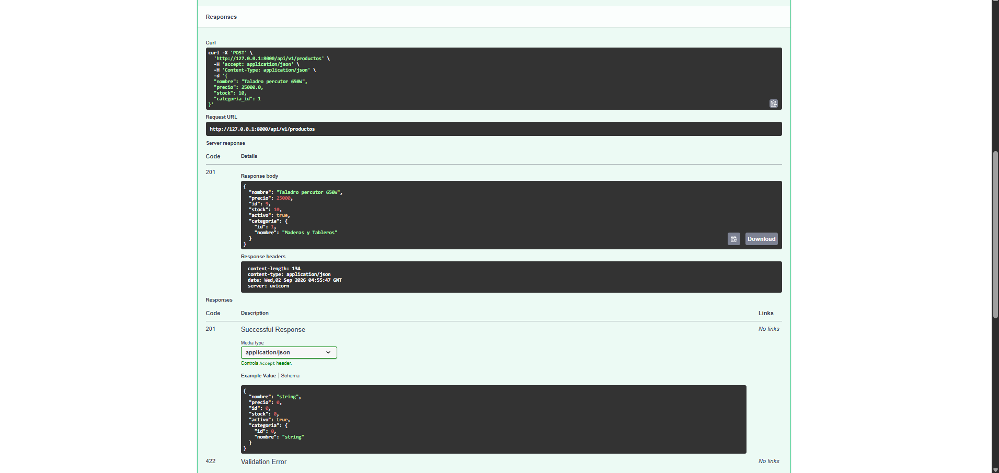
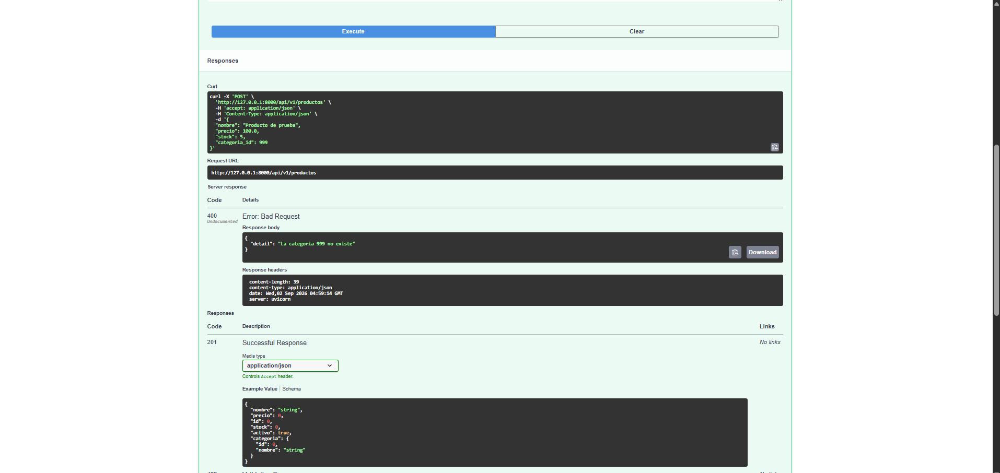
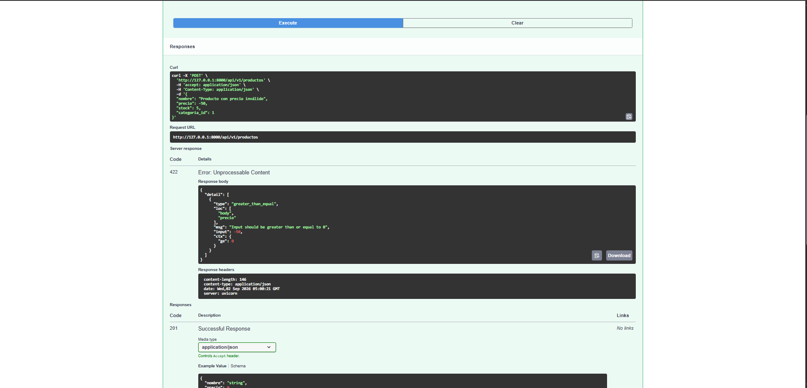
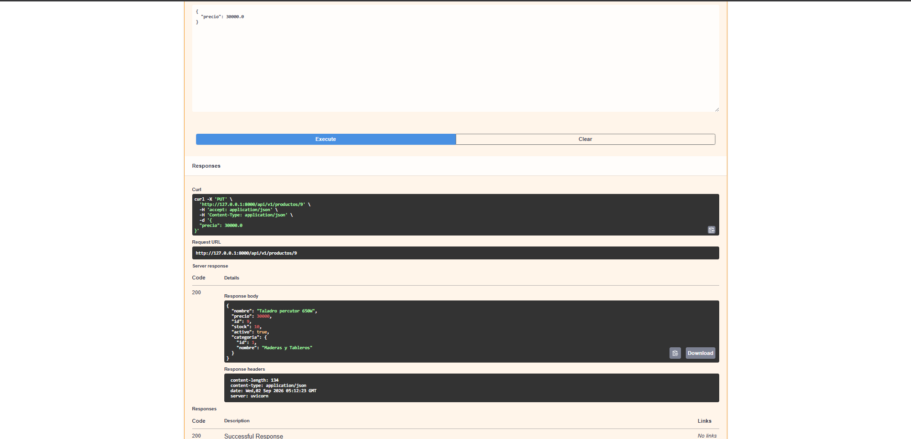
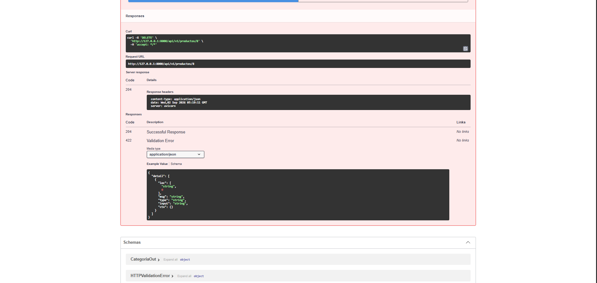
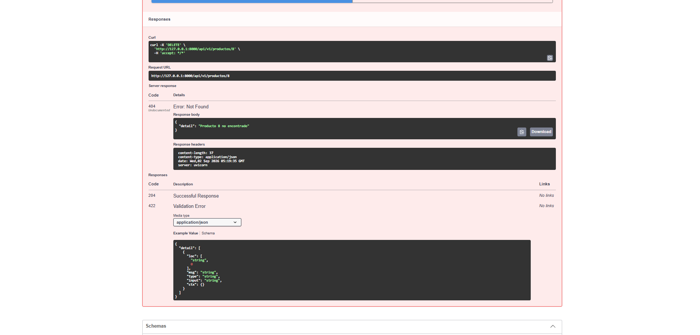

# Proyecto ProMadera — API de Productos

API REST desarrollada con FastAPI para la gestión de productos y categorías, como parte del Trabajo Práctico de la materia Prácticas Profesionalizantes II.

## Integrantes del grupo

| Nombre | Usuario de GitHub |
|---|---|
| Ariel Antonio Reynaga | [arielreynaga2662-lab](https://github.com/arielreynaga2662-lab) |
| Sheila Sabrina Lamas Wayar | [SheiiWayar](https://github.com/SheiiWayar) |
| Daniela Luz Belen Camacho | [daniicamacho27](https://github.com/daniicamacho27) |
| Joaquin Jairo Arzadum | [JoakoARZ](https://github.com/JoakoARZ) |

## Estructura del proyecto

tp-productos-api/
├── app/
│ ├── main.py # crea app, include_router
│ ├── core/
│ │ └── db.py # listas: categorias, productos
│ ├── models/
│ │ ├── categoria.py # @dataclass Categoria
│ │ └── producto.py # @dataclass Producto
│ └── api/
│ └── v1/
│ └── productos/
│ ├── router.py # endpoints /productos (APIRouter)
│ ├── schemas.py # Pydantic Base/Create/Update/Response
│ └── repository.py # acceso a datos + validaciones
├── docs/
│ └── capturas/ # capturas de Swagger UI
├── requirements.txt
├── README.md
├── .gitignore # venv/, pycache/, *.pyc
└── venv/

```bash
python -m venv venv
venv\Scripts\activate        # Windows
pip install -r requirements.txt
fastapi dev app/main.py
```

La API queda en `http://127.0.0.1:8000` y la documentación interactiva en `http://127.0.0.1:8000/docs`.

## Endpoints

| Método | Ruta | Descripción | Código éxito | Códigos error |
|---|---|---|---|---|
| GET | `/productos` | Listar (con filtros `query`, `categoria_id`) | 200 | — |
| GET | `/productos/{id}` | Obtener por ID | 200 | 404 |
| POST | `/productos` | Crear producto | 201 | 400, 422 |
| PUT | `/productos/{id}` | Actualizar (parcial) | 200 | 404, 400 |
| DELETE | `/productos/{id}` | Eliminar (baja) | 204 | 404 |

## Main: montar todo

Se instanció `FastAPI` con `title` y `description`, se agregó un `GET /` con mensaje de bienvenida, y se montó el router de productos con `app.include_router`. El servidor se levantó con `fastapi dev app/main.py` (alternativamente `uvicorn app.main:app --reload`).

**Captura de Swagger UI** mostrando los endpoints agrupados bajo la tag "Productos":



## Pruebas en Swagger UI

### a) Crear producto válido → 201



### b) Crear producto con categoría inexistente → 400



### c) Crear producto con precio negativo → 422



### d) Listar productos filtrando por nombre y categoría


### e) Actualizar solo el precio con PUT (los demás campos no cambian)



### f) Eliminar producto (204) y repetir el mismo DELETE (404)


