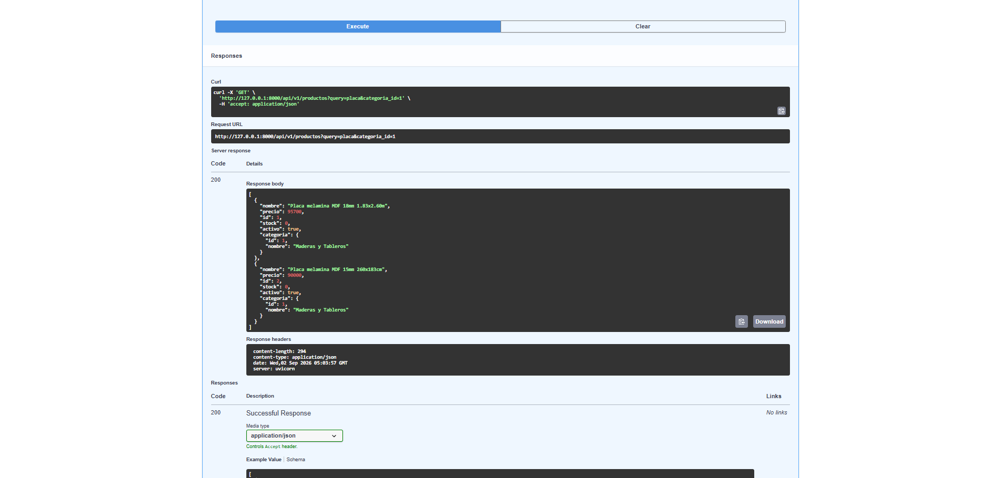

## Main: montar todo

Se instanció `FastAPI` con `title` y `description`, se agregó un `GET /` con mensaje de bienvenida, y se montó el router de productos con `app.include_router`. El servidor se levantó con `fastapi dev app/main.py` (alternativamente `uvicorn app.main:app --reload`).

**Captura de Swagger UI** mostrando los endpoints agrupados bajo la tag "Productos":

## Pruebas en Swagger UI

### a) Crear producto válido → 201

### b) Crear producto con categoría inexistente → 400

### c) Crear producto con precio negativo → 422

### d) Listar productos filtrando por nombre y categoría

### e) Actualizar solo el precio con PUT (los demás campos no cambian)

### f) Eliminar producto (204) y repetir el mismo DELETE (404)

