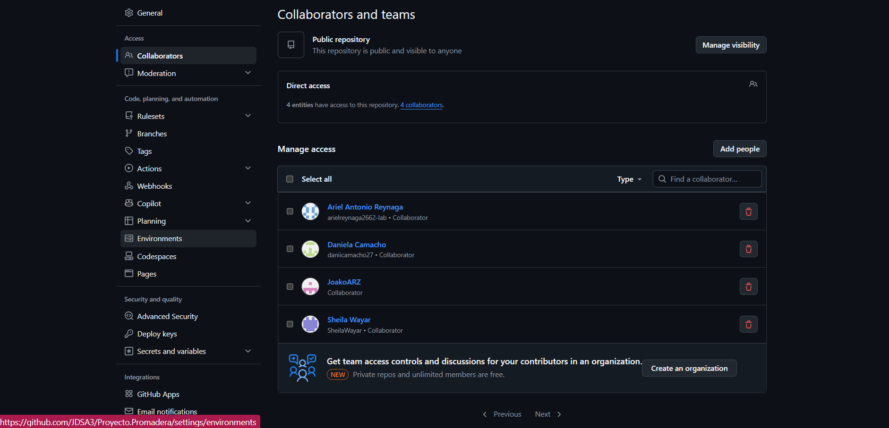
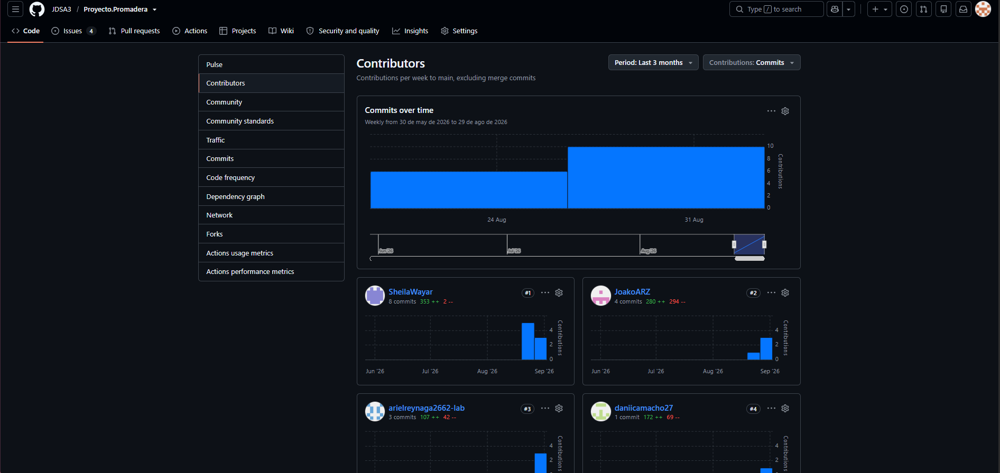
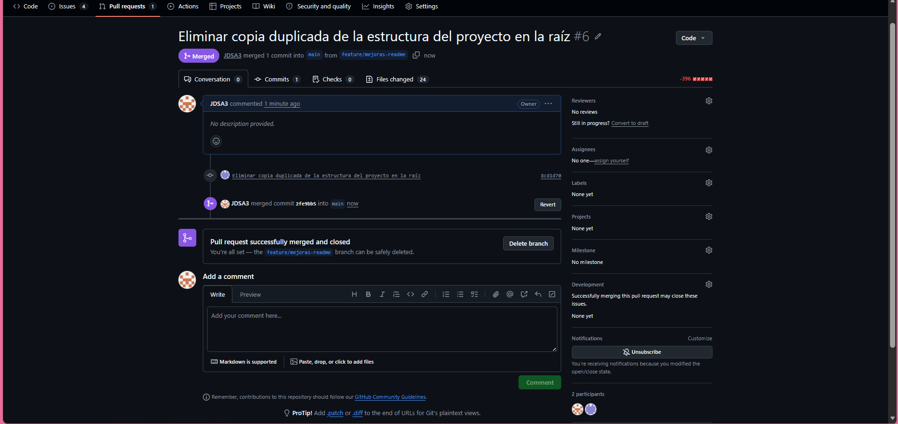

# Proyecto ProMadera — API de Productos

API REST desarrollada con FastAPI para la gestión de productos y categorías, como parte del Trabajo Práctico de la materia Prácticas Profesionalizantes II.

## Integrantes del grupo

| Nombre | Usuario de GitHub |
|---|---|
| Ariel Antonio Reynaga | [arielreynaga2662-lab](https://github.com/arielreynaga2662-lab) |
| Sheila Sabrina Lamas Wayar | [SheiiWayar](https://github.com/SheiiWayar) |
| Daniela Luz Belen Camacho | [daniicamacho27](https://github.com/daniicamacho27) |
| Joaquin Jairo Arzadum | [JoakoARZ](https://github.com/JoakoARZ) |

## Estructura del proyecto

```
tp-productos-api/
├── app/
│   ├── main.py                    # crea app, include_router
│   ├── core/
│   │   └── db.py                  # listas: categorias, productos
│   ├── models/
│   │   ├── categoria.py           # @dataclass Categoria
│   │   └── producto.py            # @dataclass Producto
│   └── api/
│       └── v1/
│           └── productos/
│               ├── router.py      # endpoints /productos (APIRouter)
│               ├── schemas.py     # Pydantic Base/Create/Update/Response
│               └── repository.py  # acceso a datos + validaciones
├── docs/
│   └── capturas/                  # capturas de Swagger UI
├── requirements.txt
├── README.md
├── .gitignore                     # venv/, __pycache__/, *.pyc
└── venv/
```

```bash
python -m venv venv
venv\Scripts\activate        # Windows
pip install -r requirements.txt
fastapi dev app/main.py
```

La API queda en `http://127.0.0.1:8000` y la documentación interactiva en `http://127.0.0.1:8000/docs`.

## Arquitectura

### Arquitectura actual

La API está organizada en capas. Cada capa tiene una sola responsabilidad y solo habla con la que tiene debajo:

```
Cliente (Swagger UI / navegador)
        │  HTTP
        ▼
FastAPI  ─ router.py + schemas.py
        │
        ▼
Repository  ─ repository.py
        │
        ▼
Lista en memoria  ─ core/db.py
```

| Capa | Archivo | Qué hace |
|---|---|---|
| FastAPI | `router.py`, `schemas.py` | Recibe las peticiones HTTP, valida los datos con Pydantic y devuelve los códigos de estado (200, 201, 204, 400, 404, 422). No tiene lógica de filtrado. |
| Repository | `repository.py` | Es el único lugar que accede a los datos: lista y filtra productos por nombre y categoría, busca por id, crea, actualiza y elimina. |
| Datos | `core/db.py` | Listas de Python en memoria con las categorías y los productos. Los cambios se pierden al reiniciar el servidor. |

El router nunca accede directo a `db.productos`: siempre pasa por el repository. Así, si cambia la forma de guardar los datos, solo hay que tocar una capa.

### Arquitectura futura (PostgreSQL)

```
Cliente → FastAPI (router.py) → Repository (repository.py) → PostgreSQL
```

Está planificada pero todavía **no está implementada**. El único cambio será reemplazar las listas en memoria por una base de datos PostgreSQL. El `repository.py` pasa a consultar la base en lugar de las listas, y el router y los schemas siguen igual, porque ya dependen solo del repository.

## Endpoints

| Método | Ruta | Descripción | Código éxito | Códigos error |
|---|---|---|---|---|
| GET | `/api/v1/productos` | Listar (con filtros `query`, `categoria_id`) | 200 | — |
| GET | `/api/v1/productos/{id}` | Obtener por ID | 200 | 404 |
| POST | `/api/v1/productos` | Crear producto | 201 | 400, 422 |
| PUT | `/api/v1/productos/{id}` | Actualizar (parcial) | 200 | 404, 400 |
| DELETE | `/api/v1/productos/{id}` | Eliminar (baja) | 204 | 404 |
| GET | `/api/v1/categorias` | Listar categorías | 200 | — |

## Main: montar todo

Se instanció `FastAPI` con `title` y `description`, se agregó un `GET /` con mensaje de bienvenida, y se montó el router de productos con `app.include_router`. El servidor se levantó con `fastapi dev app/main.py` (alternativamente `uvicorn app.main:app --reload`).

**Captura de Swagger UI** mostrando los endpoints agrupados bajo la tag "Productos":


## Frontend

Interfaz web simple en HTML, CSS y JavaScript puro, en la carpeta `frontend/`:

```
frontend/
├── index.html      # estructura de la página
├── style.css        # estilos
├── app.js            # lógica: fetch a la API, búsqueda, filtro y desplegable de categorías
├── logo.png          # imagen de respaldo si un producto no tiene foto
└── imagenes/         # fotos de productos
```

Muestra los productos activos en tarjetas con nombre, categoría, precio y stock. Consume la API con `fetch`:

- Carga las categorías desde `GET /api/v1/categorias` para llenar el desplegable.
- Busca con `?query=` (con una pequeña espera después de dejar de escribir) y filtra con `?categoria_id=`, ambos contra `GET /api/v1/productos`.
- Muestra un mensaje si no hay resultados o si la API no responde.

Para levantarlo:

1. Iniciar el backend (`fastapi dev app/main.py`, ver arriba). Ya tiene CORS habilitado.
2. Abrir `frontend/index.html` en el navegador (o usar una extensión como Live Server de VSCode).

## Pruebas en Swagger UI

### a) Crear producto válido → 201


### b) Crear producto con categoría inexistente → 400


### c) Crear producto con precio negativo → 422


### d) Listar productos filtrando por nombre y categoría


### e) Actualizar solo el precio con PUT (los demás campos no cambian)


### f) Eliminar producto (204) y repetir el mismo DELETE (404)


## Trabajo colaborativo en Git

### Colaboradores del repositorio



### Historial de commits por integrante



### Pull Request mergeado

